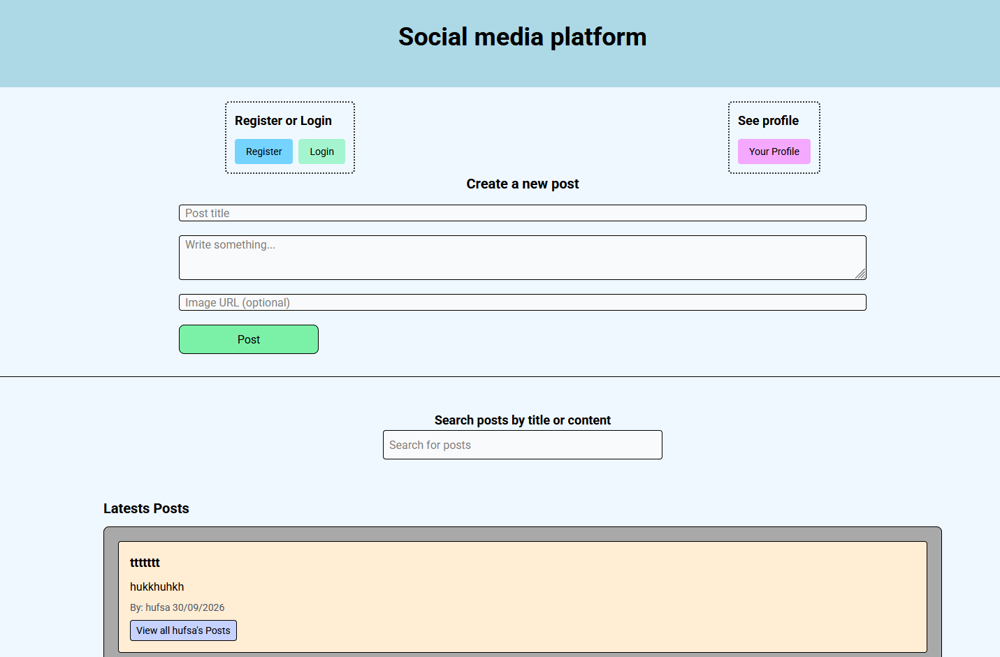
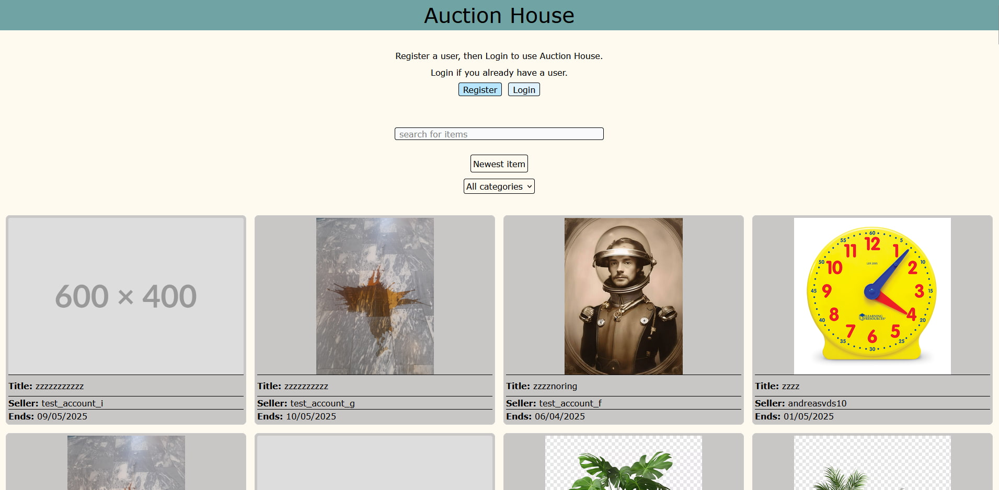
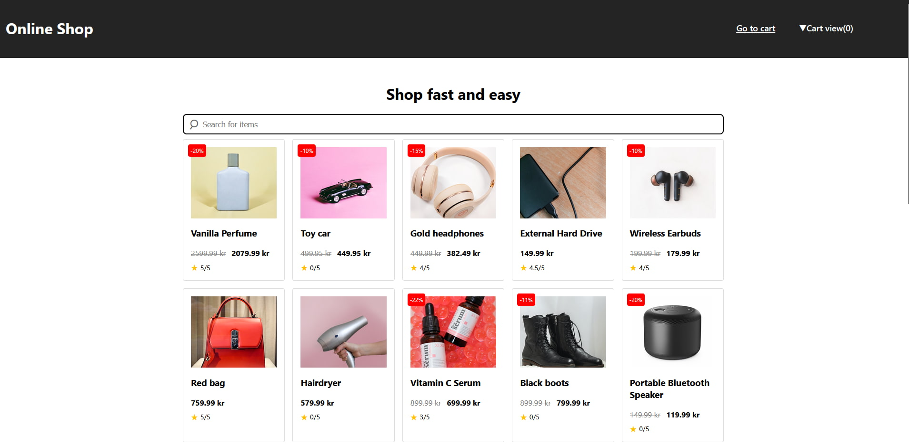

# Portfolio 2

## Projects

### 1. CSS Frameworks

### 3. Semester Project 2

### 2. JavaScript Frameworks

## Description

1. CSS Frameworks - written in HTML, CSS, TailwindCSS, JavaScript
2. JavaScript Frameworks - written in HTML5, CSS3, TailwindCSS v4, Vanilla JavaScript ES Modules
3. Semester Project 2 - written in HTML, CSS modules, Typescript, React 19, Vite 8

## Built With

- HTML
- CSS
- Vanilla JavaScript

## Getting Started

Installing.

- Clone the repo: git clone https://github.com/jb12-art/Portfolio-2.git
- Install the dependencies: npm install

## Contact

https://www.linkedin.com/

## Author

jb12-art / Jørgen Bjørnethun
